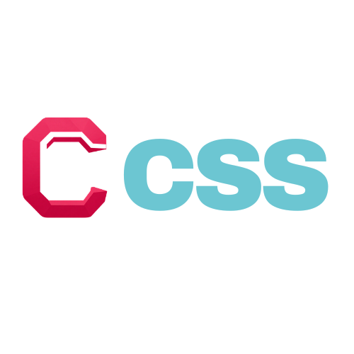

# Compact CSS




A Tailwind CSS inspired utility library. Get the same useful utility classes you already know, without a build step, config file, or complicated setup process — just link the stylesheets you need and start writing classes.

## Usage

The quickest way to use Compact CSS is via the CDN — link the pre-built, minified stylesheet directly, no download or build step required:

```html
<link rel="stylesheet" href="https://cdn.jsdelivr.net/npm/compactcss@1.0.0/dist/compact.min.css">

<div class="p-4 text-blue-500 rounded-lg">Hello, Compact CSS</div>
```

Using a bundler (Webpack, Vite, Next.js, etc.)? Install it from npm and import it directly:

```bash
npm install compactcss
```

```jsx
import 'compactcss';

function App() {
  return <div className="p-4 text-blue-500 rounded-lg">Hello, Compact CSS</div>;
}
```

Prefer to self-host or only ship the utilities you use? Clone or download this repo and link the individual stylesheets you need from the `css/` folder instead:

```html
<link rel="stylesheet" href="css/spacing/p.css">
<link rel="stylesheet" href="css/text/color.css">
<link rel="stylesheet" href="css/rounded.css">

<div class="p-4 text-blue-500 rounded-lg">Hello, Compact CSS</div>
```

See [`index.html`](index.html) for a full list of available stylesheets and a live demo of every utility class.

### State variants

Prefix any utility class with `hover:`, `focus:` or `active:` to apply it only while the element is in that state:

```html
<button class="bg-indigo-600 hover:bg-indigo-700 active:bg-indigo-800 text-white p-3 rounded-lg">
  Hover or click me
</button>
```

State variants roughly quadruple the stylesheet size, so they're built into a separate, larger bundle instead of the default one:

| Bundle | Size | Contents |
| --- | --- | --- |
| `dist/compact.min.css` | ~700KB | All utilities, **no** `hover:`/`focus:`/`active:` variants (this is the default CDN/npm import above) |
| `dist/compact.css` | ~3MB | All utilities **plus** `hover:`/`focus:`/`active:` variants for every class |

To get state variants, link (or import) `dist/compact.css` instead of the default:

```html
<link rel="stylesheet" href="https://cdn.jsdelivr.net/npm/compactcss@1.0.0/dist/compact.css">
```

```jsx
import 'compactcss/dist/compact.css';
```

They aren't part of the individual per-feature stylesheets in `css/`, so self-hosting by linking those files directly won't include `hover:`/`focus:`/`active:` classes either way.

## Features

Utility classes for:

- Layout: `display`, `position`, `overflow`, `visibility`, `flex`/`grid`
- Spacing: margin (`m`, `mt`, `mr`, `mb`, `ml`, `mx`, `my`) and padding (`p`, `pt`, `pr`, `pb`, `pl`, `px`, `py`)
- Sizing: `width`, `height`, `min`/`max` constraints
- Typography: `font`, text `align`/`color`/`decoration`/`overflow`/`shadow`/`size`/`underline`/`wrap`
- Backgrounds and borders: `bg`, `border`, `rounded`, `outline`, `shadow`
- Effects and filters: `opacity`, `blur`, `brightness`, `contrast`, `grayscale`, `hue-rotate`, `invert`, `saturate`, `sepia`, `drop-shadow`
- Interactivity: state variants (`hover:`, `focus:`, `active:`), `cursor`, `pointer-events`, `scrollbar`
- Misc: `animation`, `duration`, `gap`, UI helpers (`glass`, `bubble`)

See [`ref/colors.md`](ref/colors.md) for the full color palette reference and [`ref/sizes.md`](ref/sizes.md) for the named size scales (`xs`/`sm`/`md`/`lg`/`xl`…) used across these utilities.
